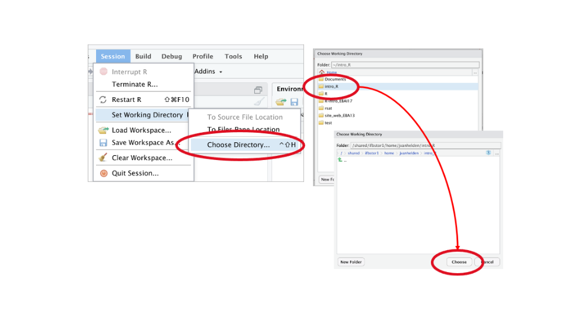
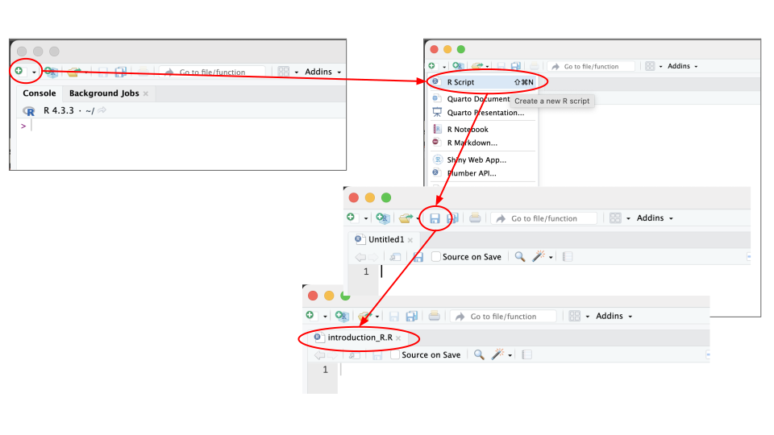
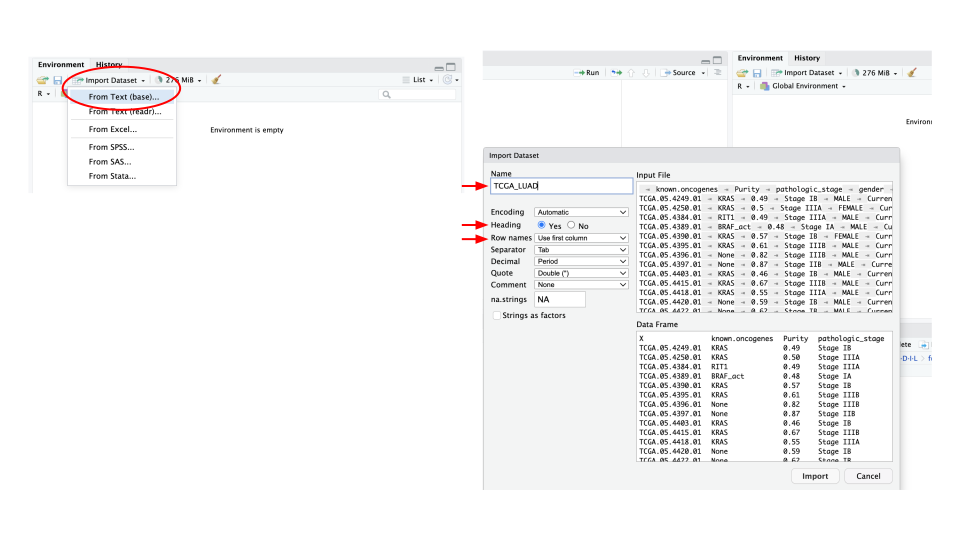

<style>
details > summary {
  padding: 4px;
  width: 400px;
  background-color: #eeeeee;
  border: none;
  box-shadow: 1px 1px 2px #bbbbbb;
  cursor: pointer;
}

details > p {
  background-color: #E0F8EC;
  padding: 4px;
  margin: 0;
  box-shadow: 1px 1px 2px #bbbbbb;
}
</style>

```{r setup, include=FALSE}
knitr::opts_chunk$set(echo = TRUE, eval = FALSE)
TCGA_LUAD <- read.delim("./datasets//TCGA_LUAD_subset.tsv", row.names = 1)

```

[<<< Back to Index](./0.course_index.html)

In this section, you will learn how to manipulate data in the form of tables. 
When we manipulate data, we use variables and functions. As you saw earlier, a variable can have several types and can contain different types of data, even an entire table with several columns and rows. Various functions can be used to dissect the table in order to retain only certain data, for example.

The most commonly used and powerful table structure is the `data.frame`. A data frame is organized into rows and columns. The rows represent observations or individual records and columns represent variables or features of the data, and each column can hold different types of data (numeric, character, logical, etc.).


But before diving into complex data exploration. We need to define a workspace where we will then write our variables, functions... in other words, the code.

# Set the working directory

A working directory contains all the data that will be useful to us (tables, images, graphics, etc.).

* Create a new folder that you can called `intro_R`
* In the "Session" menu, select "Set Working Directory" -> Choose Directory"...
* Navigate to your `intro_R` folder
* Double-click it to open
* Click Choose
* Observe the console and save the command in your script



# Create a script

The working directory will also contain the code we'll be writing as we go along, in the form of a text file called script.
The advantage of a script is that you can save your code, keep it and reuse it.

* In the RStudio window click the "create file" button
* Choose the R script format
* Save your file in your intro_R folder
* Save your script regularly




# Load the data in R

We need to load the data to be able to work. Use the directory you have created to store your data in it, this will make it easier to find the data file.


* In the "Environment" panel, select "Import Dataset"
* Select "From Text (base)..."
* Navigate to your intro_R folder
* Choose `TCGA_LUAD_subset.tsv`
* Double-click it to open
* Change the name of the variable: `TCGA_LUAD`
* Specify that the first line contains the names of the columns 
* Specify that the first row contains the names of the rows




After this last step, you can see that a variable has been created and is displayed in the “Environment” panel. This variable is called `TCGA_LUAD` (or whatever you called it) containing the data.

---

With R, it is also possible to load data using the command line. For this purpose, there are functions available for loading data.

Those functions generally begin with `read()`.

In our case the function is `read_delim()`.

```{r load data}
TCGA_LUAD <- read.delim("./datasets/TCGA_LUAD_subset.tsv", row.names = 1)
```

This function is built to load a .tsv files (tabulation-separated values). 
If you search in the help section, you will see that this function can have many arguments with some default values. But here we specify two parameters. 

# Display the data

To see your dataset, you can click on the variable in the environment to display it. You can see in the console that, after the click, a command line appears with a function called `View()`.

`View()` is a function that takes only two arguments : the object to display and the possibility to give a title to the viewer window.
But let's see how data can be displayed differently.

---

* Print all the values

```{r print}
print(TCGA_LUAD)
```

Like the `View()` function, `print()` returns all the data, with one difference. Data is not displayed in a new window, but directly in the console.

---

* Display the first rows

```{r head}
head(TCGA_LUAD)
```

The `head()` function displays only the first few lines of the table.

---

* Display a few more rows

```{r head2}
head(TCGA_LUAD, n=20)
```

The `head()` function doesn't just have one argument, it also has one that sets the number of lines to be displayed (you can verify it in Help section of RStudio).

---

* Display the last rows

```{r tail}
tail(TCGA_LUAD)
```

It is also possible to view the last lines of our data set, using the tail function. 
Like the `head()` function, `tail()` has several arguments.

---

* Dimensions of the data frame

We can display more information about our data frame : number of columns/rows, type of columns, names...

```{r ncol}
ncol(TCGA_LUAD)
```

<details>
  <summary>Solution</summary>

```{r ncol2, echo=F,eval=T}
ncol(TCGA_LUAD)
```

The `ncol()` function displays the number of columns in the data frame.

</details>

---

```{r nrow}
nrow(TCGA_LUAD)
```
<details>
  <summary>Solution</summary>

```{r nrow2, echo=F,eval=T}
nrow(TCGA_LUAD)
```

The `nrow()` function displays the number of rows in the data frame.

</details>

---

```{r dim}
dim(TCGA_LUAD)
```
<details>
  <summary>Solution</summary>

```{r dim2, echo=F,eval=T}
dim(TCGA_LUAD)
```

The `dim()` function displays the dimension of the data frame, the number of rows and columns

</details>

---

```{r colnames}
colnames(TCGA_LUAD)
```
<details>
  <summary>Solution</summary>

```{r colnames2, echo=F,eval=T}
colnames(TCGA_LUAD)
```

The `colnames()` function displays the columns names (header)

</details>

---

```{r rownames}
head(rownames(TCGA_LUAD))
```
<details>
  <summary>Solution</summary>

```{r rownames2, echo=F,eval=T}
head(rownames(TCGA_LUAD))
```


The `rownames()` function displays the rows names. 

</details>

---

# Work with the dimensions

R's strength lies in its ability to enable the user to modulate and extract certain data from a data frame more automatically than is possible with conventional spreadsheet software.
This requires a knowledge of how a data frame is organized on R. The syntax for manipulating data frames uses square brackets “[ ]”.

```{r structure}
dataframe[row_index, column_index]
```

---

* Select columns or rows by names

When there are few columns or rows, and we know their names, we can select them.
IMPORTANT : Be careful to respect the case !

```{r selectnames column}
head(TCGA_LUAD[,"Purity"])
```
<details>
  <summary>Solution</summary>

```{r selectcolnames2, echo=F,eval=T}
head(TCGA_LUAD[,"Purity"])
```

All values for the column named "Purity". But display only the 6 firsts.

</details>

---

```{r selectnames row}
TCGA_LUAD["TCGA.05.4249.01",]
```

<details>
  <summary>Solution</summary>

```{r selectrownames2, eval=T,echo=F}
TCGA_LUAD["TCGA.05.4249.01",]
```

All values for the row named "TCGA.05.4249.01".

</details>

---

```{r selectnames2 column}
head(TCGA_LUAD[,c("Purity","gender")])
```

<details>
  <summary>Solution</summary>

```{r selectnames3, eval=T,echo=F}
head(TCGA_LUAD[,c("Purity","gender")],6)
```

All values for columns "Purity" and "gender". But display only the 6 firsts.

</details>

---

```{r selectnames2 row}
TCGA_LUAD[c("TCGA.05.4249.01","TCGA.05.4250.01"),]
```

<details>
  <summary>Solution</summary>

```{r selectrownames3, eval=T,echo=F}
TCGA_LUAD[c("TCGA.05.4249.01","TCGA.05.4250.01"),]
```

All values for rows "TCGA.05.4249.01" and "TCGA.05.4250.01".

</details>

---

If you look at the Environment panel, you'll find, as we've seen, the variable containing the data frame. If you click on the little blue arrow, a drop-down list appears, showing all the columns present, their type and the first data they contain. 
There's also a dollar sign (“$”). This symbol can be used to extract column of interest.

```{r selectnames3 col}
head(TCGA_LUAD$Purity)
```

<details>
  <summary>Solution</summary>

```{r , echo=F,eval=T}
head(TCGA_LUAD$Purity)
```

</details>

---

* Select the columns or rows by their indices

Each row or column is indexed, that is, the first line is line 1, the second is line 2, etc...

In our example (TCGA_LUAD), the first column is named "known.oncogenes", this column is the column 1 (index 1).
This notion of index is important, as it will be used to extract rows/columns of interest.


So now let's extract information from our data frame !

```{r extract colrow}
TCGA_LUAD[1, 2]
```

<details>
  <summary>Solution</summary>

```{r , echo=F,eval=T}
TCGA_LUAD[1, 2]
```

The value of the first row and the second column.

</details>

---

```{r extract row}
TCGA_LUAD[1,]
```

<details>
  <summary>Solution</summary>

```{r , echo=F,eval=T}
TCGA_LUAD[1,]
```

All values of the first row, with every columns.


</details>

---

```{r extract column}
TCGA_LUAD[,2]
```

<details>
  <summary>Solution</summary>

```{r, echo=F, eval=T}
TCGA_LUAD[,2]
```

All values of the second columns, with every rows.
 
</details>

---

```{r extract more column}
head(TCGA_LUAD[,c(1:4)])
```
<details>
  <summary>Solution</summary>


```{r, echo=F, eval=T}
head(TCGA_LUAD[,c(1:4)])
```

All values of the column 1 to 4, with every rows. Display the 6 first rows.
 
</details>

---

```{r extract more row}
TCGA_LUAD[c(1:4),]
```

<details>
  <summary>Solution</summary>

```{r, echo=F, eval=T}
TCGA_LUAD[c(1:4),]
```

All values of the rows 1 to 4, with every columns.

</details>

---

```{r extract invert}
head(TCGA_LUAD[,c(2,1)])
```

<details>
  <summary>Solution</summary>

```{r, echo=F, eval=T}
head(TCGA_LUAD[,c(2,1)])
```

All values of the columns 1 and 2, inversely, with every rows. Display the 6 first rows.

</details>

---

[<<< Back to Index](./0.course_index.html)
