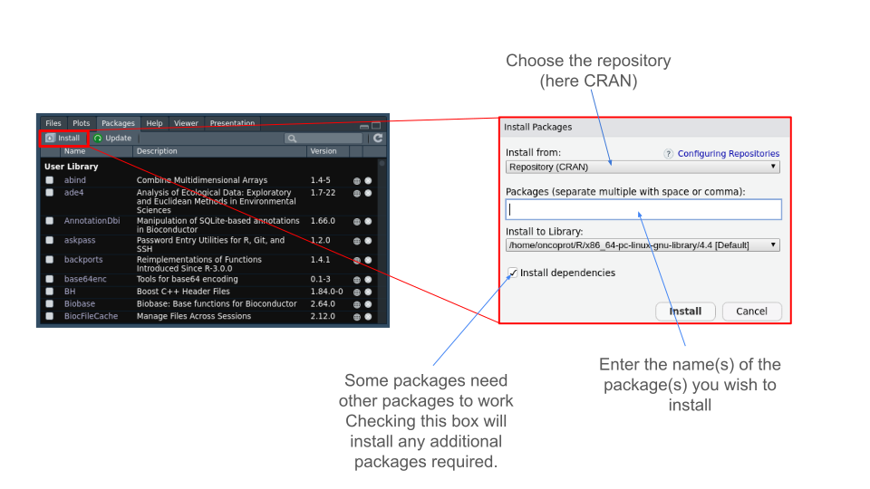

<style>
details > summary {
  padding: 4px;
  width: 400px;
  background-color: #eeeeee;
  border: none;
  box-shadow: 1px 1px 2px #bbbbbb;
  cursor: pointer;
}

details > p {
  background-color: #E0F8EC;
  padding: 4px;
  margin: 0;
  box-shadow: 1px 1px 2px #bbbbbb;
}
</style>

```{r setup, include=FALSE}
knitr::opts_chunk$set(echo = TRUE, eval = FALSE)
```

[<<< Back to Index](./0.course_index.html)

# What is a package ?

In R, packages are collections of functions, data sets, and documentation that extend the functionality of base R. They are like add-ons or plugins that provide additional tools for performing specific tasks (data analysis, visualization, machine learning...).
Think of them as libraries or modules that you can install to get extra tools for your work. Some packages come pre-installed with R, while others can be installed from repositories.

# What is a repository ?

In the context of R, a repository is a centralized location where software, code, data, or packages are stored, managed, and distributed.
A repository is essentially a storage space (either local or online) where software packages, source code, or project files are organized, tracked, and shared. It helps developers and users access the software they need, often with version control and documentation included.
It exists several repositories.

- CRAN (Comprehensive R Archive Network)

CRAN is the primary repository for R packages. It is a collection of thousands of R packages that are contributed by developers around the world. Packages stored on CRAN go through a review process to ensure quality and compatibility. CRAN allows users to install packages directly in R either via the “Packages” panel or directly using a command line.


```{r install package CRAN}
install.packages("package_name")
```

After installing a package, you need to activate it. \
Each time you close R/RStudio, any installed packages will be preserved, but will not be active when you switch R/RStudio back on. You need to activate it either by checking the box next to the package name (see image above) or by using a simple command line.

```{r activate packages}
library(package_name)
```
Note that for the library function, you must enter the package name without quotation marks.

---

- Bioconductor

Bioconductor is a repository specifically for bioinformatics and computational biology packages. It focuses on tools for analyzing omics data.
To use and fetch packages from this directory, you need to download... a package! And this package, named “BiocManager”, installs normally because it's available in CRAN.
In short, you need to download a package available in CRAN to access other packages that may be available in a directory other than CRAN.

In some cases, if you want to perform certain types of analysis and you can't find the package you need in CRAN, there's a good chance you'll find it in Bioconductor (if it involves biology-related methods or analyses).

```{r install Bioconductor}
install.packages("BiocManager")
```

After installing the “BiocManager” package, you can download the packages available in the directory.

```{r install package with Bioconductor}
BiocManager::install("package1")

BiocManager::install(c("package1","package2","package3"))
```

Please check the Bioconductor website for more information about installation and the list of available packages.

Link : [Bioconductor](https://www.bioconductor.org/install/)

---

- GitHub

GitHub is a platform for hosting code repositories, and it is widely used by R developers to share and collaborate on R packages and projects.
Developers can use GitHub to publish the latest versions of their R packages, even before they are available on CRAN. It also allows for collaboration, version control, and contribution from the open-source community.

Like Bioconductor, you'll need to install a package to download packages from GitHub.

```{r install devtools}
install.packages("devtools")
```

Once `devtools` is installed, you can download packages from the GitHub community.

```{r install package with devtools}
devtools::install_github("name_of_github_repository/package_name")
```

Note that here we don't use install_packages but install_github to fetch the package we're interested in.

Link : [GitHub](https://github.com/dashboard)

[<<< Back to Index](./0.course_index.html)
