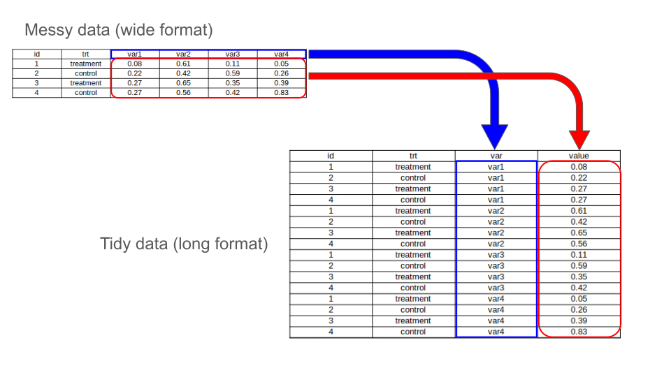

<style>
details > summary {
  padding: 4px;
  width: 400px;
  background-color: #eeeeee;
  border: none;
  box-shadow: 1px 1px 2px #bbbbbb;
  cursor: pointer;
}

details > p {
  background-color: #E0F8EC;
  padding: 4px;
  margin: 0;
  box-shadow: 1px 1px 2px #bbbbbb;
}
</style>

```{r setup, include=FALSE}
knitr::opts_chunk$set(echo = TRUE, eval = FALSE)
```

In many cases, the information you want to exploit is not contained in a single, perfectly readable dataset. It's important to be able to gather the information we have to optimize our operations.
R offers a range of functions for carrying out operations within a single dataframe or between several dataframes.

# *merge* function

The first function you can use is merge. This function is a standard feature of R and does not require you to download anything else.

```{r help merge}
help(merge)
#or
?merge
```

As always, if you're not familiar with a function, or if you're not sure how to use it, look it up with the help of R, or search directly on the Internet using the right keywords (and in English).

You can see that *merge* has many arguments. For our example, we only need 3 arguments :

* "x" : it will take the first dataframe
* "y" : it will take the second dataframe
* "by" : this argument is used to specify the column from which the dataframes are to be assembled.

This third argument is really important. This also means that to use the merge function on our two dataframes, there must be a column in common between the two. We can also have several columns in common.

---

---

*Example* :

For our example, we will take two dataframes with the following structure:

* df_1

```{r view df_1}
df_1
```
<details>
  <summary>df_1 structure</summary>

```
  id   name month_salary
1  1 Andrew         1560
2  2  Susan         1263
3  3   John         1576
4  4    Joe         1502
5  5   Jack         1684
6  6  Jacob         1774
7  7   Mary         1715
8  8   Kate         1564
```
</details>

---

* df_2

```{r view df_2}
df_2
```
<details>
  <summary>df_2 structure</summary>

```
  id       name age       position
1  1     Andrew  59            CTO
2  2      Susan  59            CFO
3  3       John  54 Administrative
4  4        Joe  50     Technician
5  6      Jacob  62     Technician
6  7       Mary  53     Technician
7  8       Kate  58     Technician
8  9 Jacqueline  39     Technician
9 10        Ivy  61     Technician
```
</details>
\
Looking at these two dataframes, the first thing we notice is that there are two common columns, “id” and “name”. Then each dataframe has its own columns.\
The second observation we can make is that there are not the same number of lines between the two dataframes. We will merge our dataframes by "id" and "name". Let's see what happens.

------------------------------------------------------------------------------------------------------------------------------------------------------------

```{r merge df_1 df_2}
df_3 <- merge(df_1, df_2, by = c("id","name"))
```
<details>
  <summary>df_3 structure</summary>

```
  id   name month_salary age       position
1  1 Andrew         1560  59            CTO
2  2  Susan         1263  59            CFO
3  3   John         1576  54 Administrative
4  4    Joe         1502  50     Technician
5  6  Jacob         1774  62     Technician
6  7   Mary         1715  53     Technician
7  8   Kate         1564  58     Technician
```
</details>
\
We have created a new variable called “df_3” which contains the result of the merge of the two dataframes “df_1” and “df_2”. What's most striking is the number of lines in this new dataframe. There are 7 lines, compared with 8 in df_1 and 10 in df_2.

In df_1, we have a line with an id/name combination that is 5/"Jack". This combination does not exist in df_2. This line is then ignored by the *merge* function.
Why doesn't merge take different lines into account?

Remember, when searching for function help, there are many other arguments than the ones we've used, including an argument called "all".
This argument allows you to specify whether you wish to keep all rows that is not common. By default, this argument is set to FALSE, so that only rows with data from both x and y are included in the output. So we need, to keep all rows, to set the argument to TRUE.

```{r merge df_1 df_2 v2}
df_4 <- merge(df_1, df_2, by = c("id","name"), all = TRUE)
```
<details>
  <summary>df_4 structure</summary>

```
   id       name month_salary age       position
1   1     Andrew         1560  59            CTO
2   2      Susan         1263  59            CFO
3   3       John         1576  54 Administrative
4   4        Joe         1502  50     Technician
5   5       Jack         1684  NA           <NA>
6   6      Jacob         1774  62     Technician
7   7       Mary         1715  53     Technician
8   8       Kate         1564  58     Technician
9   9 Jacqueline           NA  39     Technician
10 10        Ivy           NA  61     Technician
```
</details>
\
Now we have all the rows of the two dataframes df_1 and df_2. To compensate for the fact that some rows are not common and therefore lack information, NAs (Not Available) have been introduced. 

# *dplyr* package

*dplyr* is a powerful package for data manipulation. It provides set of functions that can help to simplify complex data operations. This package is part of a larger package called *tidyverse*. So we need to install *tidyverse* and it will download automatically *dplyr* and other useful packages (see the link below).

## Installation and initialisation of the package

As this package is not installed by default, it must be installed and activated.

```{r install tidyverse}
install.packages("tidyverse")
library(tidyverse)
```
The first line installs the package and the second activates the package (see Packages sheet)

Link : [Tidyverse](https://www.tidyverse.org/)

## Training dataset : "clinical_data"

For the following examples, we will take a dataset composed with some clinical variables and 10,000 patients.
The dataset is named "clinical_data". \

```{r clinical_data dataset}
head(clinical_data)
```
<details>
  <summary>clinical_data dataset structure</summary>

```
  patient_id age gender weight height blood_pressure_systolic blood_pressure_diastolic cholesterol glucose heart_rate smoking_status treatment_group
1          1  50 Female     86   1.80                      98                       91         229     112         68     Non-Smoker          Drug A
2          2  70   Male     88   1.77                     125                       78         160      79         69     Non-Smoker          Drug B
3          3  33   Male     89   1.82                     119                       84         152     126         76         Smoker          Drug A
4          4  86   Male     58   1.88                     119                       92         225     120         69         Smoker         Control
5          5  61 Female     75   1.55                     135                       76         186      98         68         Smoker          Drug B
6          6  69 Female     88   1.78                     128                       97         263     125         81         Smoker          Drug B
  treatment_response hospital_visits_last_year     diagnosis
1           Improved                         0          None
2           Worsened                         5  Hypertension
3           Worsened                        10      Diabetes
4           Improved                         0      Diabetes
5           Improved                         9 Heart Disease
6          No Change                         1          None
```
</details>

Unlike our first example, you can see in the Environment panel that this dataset contains 10,000 rows. This doesn't change the functions we'll be using; on the contrary, you'll see that you'll be able to work on very large datasets more easily.

## Possibilities with *dplyr*

* **Subset** : We can select specific portions of data, such as rows, columns, or both, from a larger data set based on certain conditions. Subsetting allows to extract meaningful data for analysis without modifying the original data set. We can subset rows or columns or both.


------------------------------------------------------------------------------------------------------------------------------------------------------------

* **Reshape** : We can change the layout of a dataset. It means, for example, transform columns into rows or the invert. This is a common task in data analysis, particularly when you need to organize data in a structure that is best suited for your analysis. In R, this often involves transforming data between long (tidy) and wide formats (messy).
In a wide format, each row represent a single observation, and columns represent variables (like in our df_1 or df_2 examples).
In a long format, each row is a single measurement, with a separate column for the variable and the value. This structure will be useful later for certain graphical representations.


------------------------------------------------------------------------------------------------------------------------------------------------------------

* **Modify** : We can add new columns or modify existing columns in a dataframe. It allows to create new variables based on existing ones or to change the values in existing columns.


IMPORTANT : Before diving into the details of the package and its possibilities, you need to know there's a special way of using the functions in this package. We will take a look at a new symbol called pipe operator : "%>%". This symbol is used to link several operations (functions) to achieve the desired result.

```{r pipe example}
your_dataset %>% 
  function1(...) %>%
  function2(...)
```

Here the functions correspond tot he function available in *dplyr* package.
Let's take a look at some of the most important functions.

------------------------------------------------------------------------------------------------------------------------------------------------------------

### *filter* function

The first function we will see is the *filter* function. This function allows you to extract the row(s) you are interested in based on a condition in column(s).

```{r filter help}
?dplyr::filter
```
NOTE : Here, we specify the package name with a double colon (::) and then the function name, to avoid conflicts between functions that may have the same name.

Example : Extract every female patients

```{r filter example}
clinical_data %>% 
  filter(gender == "Female")
```
<details>
  <summary>filter by gender</summary>

```
  patient_id age gender weight height blood_pressure_systolic blood_pressure_diastolic cholesterol glucose heart_rate smoking_status treatment_group
1          1  50 Female     86   1.80                      98                       91         229     112         68     Non-Smoker          Drug A
2          5  61 Female     75   1.55                     135                       76         186      98         68         Smoker          Drug B
3          6  69 Female     88   1.78                     128                       97         263     125         81         Smoker          Drug B
4         12  28 Female     86   1.74                     132                       76         244      87         62         Smoker          Drug A
5         13  45 Female     92   1.70                     124                       82         244     118         87     Non-Smoker          Drug A
6         14  26 Female    101   1.62                     114                       51         131      86         67     Non-Smoker         Control
  treatment_response hospital_visits_last_year     diagnosis
1           Improved                         0          None
2           Improved                         9 Heart Disease
3          No Change                         1          None
4           Worsened                         1      Diabetes
5          No Change                         3  Hypertension
6          No Change                         1 Heart Disease
...
...
...
     patient_id age gender weight height blood_pressure_systolic blood_pressure_diastolic cholesterol glucose heart_rate smoking_status treatment_group
4999       9992  54 Female     56   1.65                     108                       83         222      85         47         Smoker          Drug A
5000       9993  61 Female    105   1.76                     103                       89         231     132         66         Smoker         Control
5001       9995  55 Female     89   1.87                     147                       69         284     100         67     Non-Smoker         Control
5002       9996  39 Female     73   1.52                     115                       82         213     121         71     Non-Smoker          Drug B
5003       9997  26 Female    109   1.87                     118                       73         211      88         64         Smoker         Control
5004      10000  67 Female     69   1.61                     120                       67         235      95         79         Smoker          Drug A
     treatment_response hospital_visits_last_year     diagnosis
4999          No Change                         9  Hypertension
5000           Worsened                         1  Hypertension
5001          No Change                         1 Heart Disease
5002          No Change                        10 Heart Disease
5003           Worsened                         2          None
5004          No Change                         9 Heart Disease
```
</details>

To filter by gender, we refer to the "gender" column and set that we want only female patients with the equality operator “==”.

------------------------------------------------------------------------------------------------------------------------------------------------------------

### *select* function

The function *select* allows to extract the columns(s).

```{r select help}
?dplyr::select
```

Example : Extract informations about blood pressure (systolic and diastolic)

```{r select example}
clinical_data %>% 
  select(blood_pressure_systolic, blood_pressure_diastolic)
```
<details>
  <summary>select informations about blood pressure</summary>

```
  blood_pressure_systolic blood_pressure_diastolic
1                      98                       91
2                     125                       78
3                     119                       84
4                     119                       92
5                     135                       76
6                     128                       97
...
...
...
      blood_pressure_systolic blood_pressure_diastolic
9995                      147                       69
9996                      115                       82
9997                      118                       73
9998                      141                       76
9999                      139                       80
10000                     120                       67
```
</details>

This function is particularly interesting because it can be combined with other functions to either be more precise, or to search for something more vague.

| Functions to combine with *select* | Description | Examples |
|----------|----------|----------|
| *starts_with()* | Starts with a specific character/string | **clinical_data %>% select(starts_with("treatment"))** |
| *ends_with()* | Ends with a specific character/string | **clinical_data %>% select(ends_with("lic"))** |
| *contains()* | Contains a specific character/string | **clinical_data %>% select(contains("blood"))** |

These are just a few examples - there are many others, but these are the most important and widely used.\
It's up to you to use them, test them and change them to understand how they work !

------------------------------------------------------------------------------------------------------------------------------------------------------------

## *mutate* function 

We've already seen how to select datasets, but there may be times when we need to create new information from existing ones.
This is the role of the *mutate* function.

```{r mutate help}
?dplyr::mutate
```

Example : Calculate the BMI for each patient

```{r mutate example}
clinical_data <- clinical_data %>%
                  mutate(BMI = weight / height)
head(clinical_data)
```
<details>
  <summary>print the first lines</summary>

```
  patient_id age gender weight height blood_pressure_systolic blood_pressure_diastolic cholesterol glucose heart_rate smoking_status treatment_group
1          1  50 Female     86   1.80                      98                       91         229     112         68     Non-Smoker          Drug A
2          2  70   Male     88   1.77                     125                       78         160      79         69     Non-Smoker          Drug B
3          3  33   Male     89   1.82                     119                       84         152     126         76         Smoker          Drug A
4          4  86   Male     58   1.88                     119                       92         225     120         69         Smoker         Control
5          5  61 Female     75   1.55                     135                       76         186      98         68         Smoker          Drug B
6          6  69 Female     88   1.78                     128                       97         263     125         81         Smoker          Drug B
  treatment_response hospital_visits_last_year     diagnosis      BMI
1           Improved                         0          None 47.77778
2           Worsened                         5  Hypertension 49.71751
3           Worsened                        10      Diabetes 48.90110
4           Improved                         0      Diabetes 30.85106
5           Improved                         9 Heart Disease 48.38710
6          No Change                         1          None 49.43820
```
</details>

A new column has appeared, called BMI. This new variable is the result of the ratio between the weight and height variables.

------------------------------------------------------------------------------------------------------------------------------------------------------------

## *group_by* function

*group_by* is used to group data based on one or more variables (columns). This function is often used in conjunction with other *tidyverse* functions.

```{r group_by help}
?dplyr::group_by
```

One function that works perfectly with *group_by* is *summarize*.
For example, we want to know the age mean for each gender :

```{r group_by summarize example}
clinical_data %>%
  group_by(gender) %>%
  summarize(mean_age = mean(age))
```
<details>
  <summary>result of the group_by</summary>

```
# A tibble: 2 × 2
  gender mean_age
  <chr>     <dbl>
1 Female     54.8
2 Male       55.1
```
</details>

To carry out this operation, we put two functions in a row, always using the %>% symbol. 
The *group_by* function first groups the variable we're interested in, in this case “gender”. There are only two possibilities for this variable, “Male” or “Female”. Secondly, the *summarize* function takes into account the “age” variable, calculating the average for each possibility of the “gender” variable. What's more, the *summarize* function displays the results in the console, rather than entering them directly into the dataframe.

------------------------------------------------------------------------------------------------------------------------------------------------------------

## *gather* and *spread* function

These functions are not part of *dplyr*, but of another package called *tidyr*, which is also part of the *tidyverse.*  Since we installed *tidyverse* earlier, we don't need to reinstall *tidyr*.
*gather* function enables to gather columns into rows, and *spread* function allows to spread rows into columns (see Reshape part).
We say that *gather* reshapes wide format to long format and *spread* do the invert.
Wide format is sometimes called messy and long format is named tidy.

We will work with the dataset named "messy_data". This dataset is in wide format (messy) and we will transform it in long format (tidy).

* *gather*

```{r gather help}
?dplyr::gather
```

```{r gather example}
tidy_data <- messy_data %>% 
                  gather(var, value, var1:var4)
```

* *spread*

```{r spread help}
?dplyr::spread
```

```{r spread example}
messy_data <- tidy_data %>% 
                  spread(var, value)
```



If we look at the *gather* and *spread* parameters, there are arguments in particular that will interest us :

  * **key** : this argument specifies the name of the new column that will contain the names of the existing columns being collapsed. It represents the                   "variable names" in the long format
  * **value** : this argument specifies the name of the new column that will contain the values from the gathered columns.

In our example, we named the key "var" and value is simply named "value". The "var" key takes every variable names ("var1", "var2", "var3" and "var4") and the value will be every values in the variables columns ("var1:var4").

